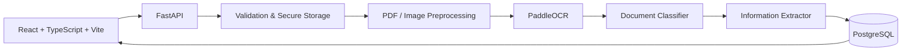

# AI Document Intelligence

AI-powered document processing platform that transforms invoices, receipts, CVs, contracts, and delivery notes into structured, searchable data using OCR, document classification, and information extraction.

The project is designed as a modular, portfolio-quality MVP with a clear path toward advanced document AI models such as LayoutLMv3, Donut, and document VLMs.

---

## 🚀 Overview

AI Document Intelligence (DocIQ) allows users to upload business documents and automatically transform them into structured information.

The application:

1. Validates the uploaded document
2. Renders PDF pages and preprocesses images
3. Runs OCR using PaddleOCR
4. Captures extracted text, confidence scores, and document coordinates
5. Classifies the document type
6. Extracts relevant structured fields
7. Stores the results in PostgreSQL
8. Presents the extracted information and OCR evidence through a React dashboard

The system is designed around replaceable AI components, allowing the current explainable baseline to be replaced by more advanced document AI models without redesigning the API or frontend.

---

## ✨ Features

### Document Processing

* PDF, PNG, JPG, and JPEG upload
* File type and size validation
* Multi-page PDF rendering with PyMuPDF
* Image preprocessing with OpenCV
* OCR with PaddleOCR
* OCR confidence scores
* Normalized OCR bounding boxes
* Visual OCR evidence

### Document Intelligence

* Document type classification
* Invoice information extraction
* Rule-based structured data extraction
* Confidence-aware processing
* Conservative extraction that avoids guessing missing information
* Modular classifier and extractor interfaces

### Dashboard

* React + TypeScript interface
* Document upload workflow
* Upload and processing status
* Document history
* Search and filtering
* Document preview
* OCR bounding-box overlays
* Extracted structured information
* Confidence indicators
* Safe document deletion

### Backend & API

* FastAPI REST API
* PostgreSQL persistence
* Pagination
* Health monitoring endpoint
* Automatic OpenAPI documentation
* Swagger UI and ReDoc

### Engineering & DevOps

* Dockerized application
* Docker Compose development environment
* Environment-based configuration
* Automated backend tests with Pytest
* Modular backend architecture
* GitHub Actions CI/CD

---

## 🖥️ Screenshots

### Dashboard


### Document Analysis


### OCR Evidence


---

## 🛠️ Tech Stack

| Layer            | Technologies            |
| ---------------- | ----------------------- |
| Frontend         | React, TypeScript, Vite |
| Backend          | Python, FastAPI         |
| OCR              | PaddleOCR               |
| Image Processing | OpenCV                  |
| PDF Processing   | PyMuPDF                 |
| Database         | PostgreSQL              |
| API              | REST, OpenAPI           |
| Testing          | Pytest                  |
| Containerization | Docker, Docker Compose  |
| CI/CD            | GitHub Actions          |

---

## 🏗️ Architecture



The application separates document ingestion, OCR, classification, extraction, and persistence into independent components.

This makes the AI pipeline easier to test, maintain, and extend.

---

## 🧠 AI / Document Processing Pipeline

```text
Document
   ↓
Validation
   ↓
PDF / Image Preparation
   ↓
OCR
   ↓
Document Classification
   ↓
Information Extraction
   ↓
Structured Data
   ↓
PostgreSQL
   ↓
React Dashboard
```

### Current MVP

The current MVP uses:

* PaddleOCR for text recognition
* Explainable keyword-based document classification
* Rule-based information extraction
* Confidence-aware OCR results
* Normalized bounding boxes for visual evidence

The baseline intentionally favors explainability and predictable behavior rather than guessing missing information.

If an invoice number or other field cannot be reliably extracted, the system keeps the value empty rather than generating an unsupported value.

---

## 🧩 Modular AI Architecture

The classification and extraction layers are implemented through replaceable interfaces.

```text
DocumentClassifier
        │
        ├── BaselineClassifier
        └── Future: LayoutLMClassifier

InformationExtractor
        │
        ├── RuleBasedExtractor
        └── Future: TransformerExtractor
```

This allows future machine learning models to replace the baseline implementations without changing the API routes or frontend application.

---

## 🔬 Key Engineering Highlights

* Built a modular document-processing pipeline combining OCR, PDF processing, image preprocessing, classification, and structured extraction.
* Integrated PaddleOCR to extract text, confidence scores, and document coordinates.
* Implemented normalized bounding boxes to connect extracted OCR results with visual document evidence.
* Designed replaceable classifier and extractor interfaces for future ML model integration.
* Implemented conservative extraction logic to prevent unsupported values from being fabricated.
* Built REST APIs with FastAPI and automatic OpenAPI documentation.
* Implemented PostgreSQL persistence for document metadata and processing results.
* Developed a React dashboard for document management and visual analysis.
* Containerized the application and database using Docker Compose.
* Added automated backend tests using Pytest.
* Implemented GitHub Actions workflows for automated validation and builds.
* Designed the system with a clear path toward asynchronous processing, advanced document AI models, authentication, and cloud deployment.

---

## 📡 API

| Method   | Endpoint                      | Description                            |
| -------- | ----------------------------- | -------------------------------------- |
| `GET`    | `/api/health`                 | Check API and database health          |
| `POST`   | `/api/documents/upload`       | Upload and store a document            |
| `POST`   | `/api/documents/{id}/process` | Run the document processing pipeline   |
| `GET`    | `/api/documents`              | Retrieve paginated document history    |
| `GET`    | `/api/documents/{id}`         | Retrieve document results and metadata |
| `DELETE` | `/api/documents/{id}`         | Delete a document safely               |

### Interactive API Documentation

Once the application is running:

* Swagger UI: `http://localhost:8080/api/docs`
* ReDoc: `http://localhost:8080/redoc`

---

## 🐳 Run Locally with Docker

### Prerequisites

* Docker
* Docker Compose
* Git

### Clone the repository

```bash
git clone https://github.com/ranimglee/ai-document-intelligence.git
cd ai-document-intelligence
```

### Configure environment variables

```bash
cp .env.example .env
```

Update the `.env` file if necessary.

### Start the application

```bash
docker compose up --build
```

The application will then be available at:

```text
Frontend: http://localhost:3000
API:      http://localhost:8080
Swagger:  http://localhost:8080/api/docs
```

---

## 🧪 Testing

Backend tests are implemented using Pytest.

From the backend directory:

```bash
pytest
```

The test suite currently covers areas including:

* API health checks
* Baseline document classification
* Information extraction
* Extraction safety

---

## 📁 Project Structure

```text
ai-document-intelligence/
│
├── backend/
│   ├── app/
│   │   ├── api/
│   │   ├── services/
│   │   ├── models/
│   │   ├── schemas/
│   │   └── ...
│   └── tests/
│
├── frontend/
│   ├── src/
│   │   ├── components/
│   │   ├── pages/
│   │   ├── services/
│   │   └── ...
│
├── docs/
│   └── screenshots/
│
├── docker-compose.yml
├── .env.example
├── .gitignore
└── README.md
```

---

## 🔐 Security & Data Handling

The application is designed as a local-first MVP.

Uploaded files are validated before processing and stored through controlled application paths.

Sensitive configuration such as database credentials should be provided through environment variables rather than committed to the repository.

The `.env` file should never be committed to Git.

---

## ⚠️ Current Limitations

The current version is intentionally an MVP.

* Document processing is synchronous.
* PaddleOCR runs on CPU in the default setup.
* Classification uses an explainable baseline rather than a trained deep-learning model.
* Information extraction relies on deterministic rules.
* Authentication is not implemented yet.
* Human-in-the-loop correction is not implemented yet.
* Cloud deployment is not included in the current version.
* Large-scale asynchronous processing is not yet implemented.

---

## 🚀 V2 Roadmap

### AI / Machine Learning

* [ ] Fine-tuned LayoutLMv3 classifier
* [ ] Donut-based document understanding
* [ ] Document VLM integration
* [ ] Layout-aware information extraction
* [ ] Improved confidence scoring
* [ ] Multi-language document processing

### Platform

* [ ] Asynchronous document processing
* [ ] Background workers
* [ ] Job queue
* [ ] Human correction workflow
* [ ] Authentication and authorization
* [ ] Role-based access control
* [ ] Advanced document search

### DevOps

* [ ] Production cloud deployment
* [ ] Monitoring and observability
* [ ] Centralized logging
* [ ] Metrics and alerting
* [ ] Automated production deployment

---

## 🎯 Use Cases

The platform can be adapted to process:

* 🧾 Invoices
* 🛒 Receipts
* 📄 Contracts
* 👤 CVs / Resumes
* 🚚 Delivery notes
* 📦 Purchase orders
* 🏦 Financial documents
* 🏢 Business forms

---

## 💡 Why This Project?

Traditional document workflows often require employees to manually read documents and enter information into business systems.

DocIQ explores how OCR and document intelligence can automate this workflow by turning unstructured documents into structured, searchable data while keeping the extracted information traceable to the original document.

---

## 📌 Project Status

**MVP — v0.1.0**

The project is structured for future expansion into a production-grade document intelligence platform.

---

## 👩‍💻 Author

**Ranim Abassi**

Software Engineer interested in:

* Backend Development
* Full-Stack Development
* AI / Machine Learning
* Document Intelligence
* DevOps & Cloud

GitHub: https://github.com/ranimglee

---

## 📄 License

This project is available under the MIT License.
