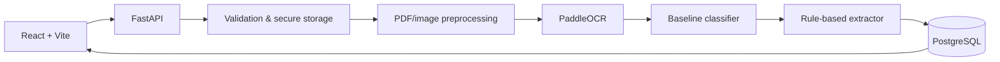

# AI Document Intelligence

A local-first, portfolio-quality MVP for transforming PDFs and images into searchable, structured document data. Upload an invoice, receipt, CV, contract, or delivery note; the application runs OCR, classifies the document, extracts available fields, and presents the evidence in a visual dashboard.

## Features

- PDF, PNG, JPG, and JPEG upload with type and size validation
- Multi-page PDF rendering with PyMuPDF and image preprocessing with OpenCV
- PaddleOCR text, confidence, and normalized bounding-box capture
- Replaceable ML interfaces with keyword baseline classification and rule-based extraction
- PostgreSQL persistence, document history, filtering, and safe deletion
- React dashboard, upload progress, document preview, and OCR overlays
- FastAPI OpenAPI documentation at `/docs` and `/redoc`

## Architecture



## Run locally with Docker

```bash
git clone <your-repository-url>
cd ai-document-intelligence
cp .env.example .env
docker compose up --build
```

Open [http://localhost:8080](http://localhost:8080). The API is available at [http://localhost:8080/api/docs](http://localhost:8080/api/docs).

## Main API

| Method | Endpoint | Purpose |
| --- | --- | --- |
| `GET` | `/api/health` | Service/database health |
| `POST` | `/api/documents/upload` | Store a document |
| `POST` | `/api/documents/{id}/process` | Run the AI pipeline |
| `GET` | `/api/documents` | Paginated document history |
| `GET` | `/api/documents/{id}` | Results and metadata |
| `DELETE` | `/api/documents/{id}` | Safely delete a document |

## AI pipeline

`Document → validation → PDF/image preparation → OCR → classification → extraction → structured data`

The baseline intentionally uses explainable keyword and regular-expression heuristics. `DocumentClassifier` and `InformationExtractor` are interfaces: replace `BaselineClassifier` with a `LayoutLMClassifier`, or `RuleBasedExtractor` with a transformer-backed extractor, without changing routes or the UI.

## Tests

Backend tests include health, baseline classification, and extraction safety. Run from `backend/`:

```bash
pytest
```

## Screenshots

_Add dashboard and document-detail screenshots here after deployment._

## Limitations and V2

This MVP processes synchronously, uses CPU PaddleOCR, and its rules are deliberately conservative; missing fields remain null rather than being guessed. V2 priorities: fine-tuned LayoutLMv3/Donut or document VLM models, asynchronous workers, human correction workflows, authentication, monitoring, and cloud deployment.
